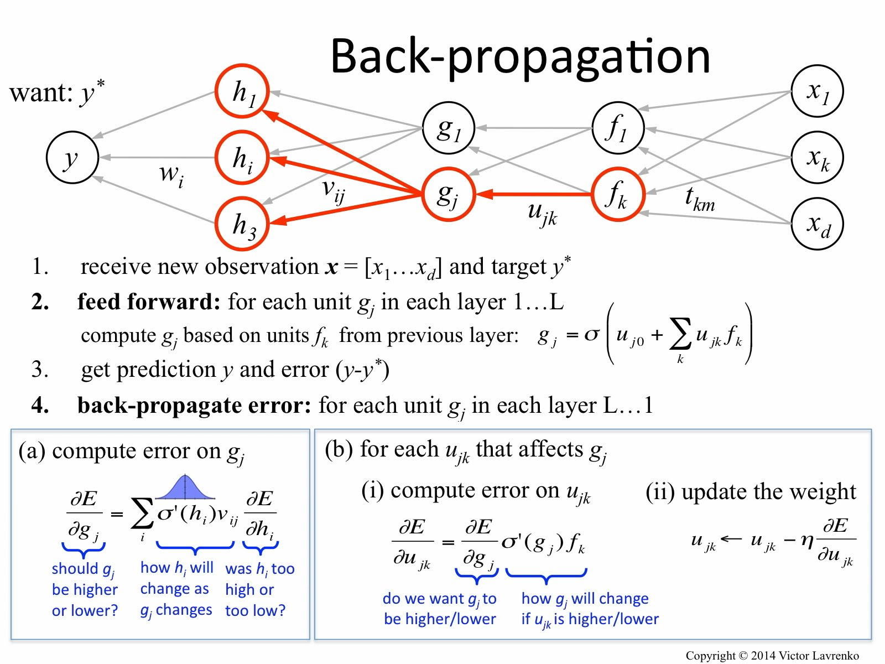
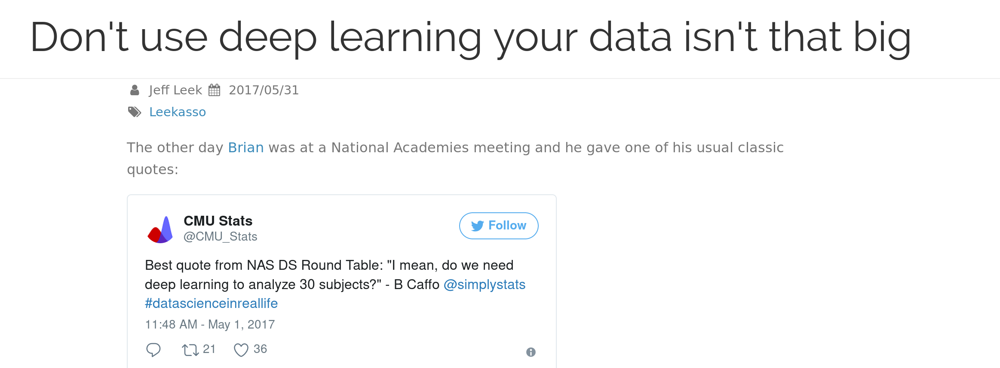
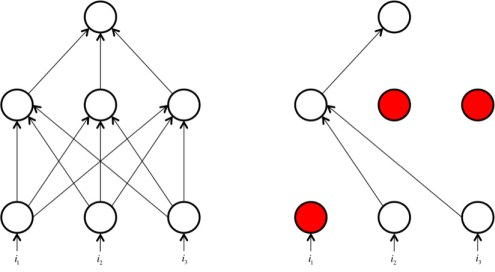

## About me

- Senior Data Scientist at Pandata LLC ([http://pandata.co](http://pandata.co))
- Applying ("classical") ML to cybersecurity
- Delving more into deep learning / AI methods

## Acknowledgements
- [rstudio/keras documentation](https://rstudio.github.io/keras/)
- Jason Mancuso (@[jvmancuso](https://twitter.com/jvmancuso))
- my wife Naya (for letting me borrow her laptop for this talk)

## Disclaimer

Not a comprehensive introduction to deep learning, pointers to learning materials towards the end.

The talk and **demo code** can be accessed at [https://git.io/v7ysE](https://git.io/v7ysE)

## [Keras](https://keras.io/)

Keras is a high-level neural networks API, written in Python and capable of running on top of TensorFlow, CNTK, or Theano.

Originally developed by François Chollet to facilitate AI research, the guiding principles were simplicity and rapid prototyping.

_Being able to go from idea to result with the least possible delay is key to doing good research._ (source: [Keras.io](Keras.io))

## What's in a name?

Keras (κέρας) means horn in Greek. It is a reference to a literary image from ancient Greek and Latin literature, first found in the Odyssey, where dream spirits (Oneiroi, singular Oneiros) are divided between those who deceive men with false visions, who arrive to Earth through a gate of ivory, and those who announce a future that will come to pass, who arrive through a gate of horn. It’s a play on the words κέρας (horn) / κραίνω (fulfill), and ἐλέφας (ivory) / ἐλεφαίρομαι (deceive).

Keras was initially developed as part of the research effort of project ONEIROS (Open-ended Neuro-Electronic Intelligent Robot Operating System).

## Neural Networks


## Neurons


## Popular activation functions

Hidden layers:

- sigmoid
- tanh
- ReLU (Rectifier Linear Unit)

Output layers:

- linear
- softmax
- sigmoid
- tanh

## What makes it deep - Layers


## How does it learn?


## Supervised Learning

Given a dataset of input values $X$ and the corresponding outputs $y$, learn a generalizable
function $h(X)$.

DNNs are very effective at fitting non-linear $h(X)$ and achieve SOA on supervised machine learning tasks.


## Loss function
Loss (or cost) function is a function that tells us how much off we are from the true values $y$.

Mean squared error is a famous one.

For classification problems, we will use categorical cross-entropy.

More losses here: [https://keras.io/losses/](https://keras.io/losses/)

## ML ~= Optimization
The objective of deep learning, then, is to update the weights between layers of the neural network so as to minimize the cost function on the test set.

## Backpropagation


## Tensors
What neural networks crave

## Tensorflow, Theano, and friends
- highly optimized for tensor operations
- typically low-level (C, Lua)

## Deep Learning in a Nutshell
A better etymology?


Some general considerations follow.

## When not to use it
 

- no time to train, retrain, tune hyperparameters
- limited computational resources
- dataset limitations

## Although...


## Avoid overfitting


## Dropout


## CNNs


Intuitive introduction:

[https://algobeans.com/2016/01/26/introduction-to-convolutional-neural-network/](https://algobeans.com/2016/01/26/introduction-to-convolutional-neural-network/)

## keras and 🐍
Simple feedforward network in Python version of keras:

```python
from keras.models import Sequential

model = Sequential()

from keras.layers import Dense, Activation

model.add(Dense(units=64, input_dim=100))
model.add(Activation('relu'))
model.add(Dense(units=10))
model.add(Activation('softmax'))

model.compile(loss=keras.losses.categorical_crossentropy,
              optimizer=keras.optimizers.SGD(lr=0.01, 
                                             momentum=0.9,
                                             nesterov=True))
              
model.fit(x_train, y_train, epochs=5, batch_size=32)

classes = model.predict(x_test, batch_size=128)
```

[https://keras.io/models/sequential/](https://keras.io/models/sequential/)
[https://keras.io/layers/core/](https://keras.io/layers/core/)

## Keras and R

- Taylor Arnold's _kerasR_:

https://github.com/statsmaths/kerasR

- J.J. Allaire's _rstudio/keras_:

https://rstudio.github.io/keras/

Both rely on [_reticulate_](https://github.com/rstudio/reticulate), R interface to Python.

## Option 1: Install kerasR

1. Install Anaconda
https://www.continuum.io/downloads

2. Create a new environment
https://conda.io/docs/using/envs.html

```
conda create --name dlnn python=3.6 anaconda
```

3. Install TensorFlow (or Theano!)
https://www.tensorflow.org/install/

Be sure to pick the GPU version if you have an NVIDIA card!

## Option 1 (continued): Install kerasR

In R:

4. Install _kerasR_ package (also _reticulate_)
```r
install.packages("kerasR")
```

5. Activate previously created Anaconda environment
```r
reticulate::use_condaenv("dlnn")
```

6. Test keras availability (should return TRUE)
```r
reticulate::py_module_available("keras")
```

## Option 2: Install rstudio/keras
1. Install Anaconda

https://www.continuum.io/downloads

In RStudio:

2. Install from GitHub (as of 08/17)

```r
devtools::install_github("rstudio/keras")
```

3. Have RStudio handle keras installation

```r
library(keras)
install_keras(method = conda, tensorflow_gpu = FALSE) # TRUE for GPU
```
https://rstudio.github.io/keras/reference/install_keras.html

## MNIST

We are going to train a CNN (convolutional neural network) on a MNIST dataset containing labeled digits 0-9.

Goal: given a labeled training set, correctly classify new images as the corresponding digit.


[](http://yann.lecun.com/exdb/mnist/)
## Demo
## notMNIST

MNIST is a classic / clean dataset.

notMNIST is a more challenging dataset developed by Yaroslav Bulatov (Google Brain / OpenAI).


Useful for the demo code:

https://github.com/davidflanagan/notMNIST-to-MNIST

## Concluding remarks

Keras is great for rapid prototyping and learning!

When not to use Keras?

- neural nets in production
- need a good debugger (TF / PyTorch)
- need a dynamic computational graph (use PyTorch!)

## More Keras


[Keras.io](http://keras.io)


## More Deep Learning


## Even More Deep Learning


## More CNNs
http://cs231n.github.io/


## More Deep Learning Theory


## Questions

## Thanks!

Let's keep in touch:

+ Email: [b@bmorphism.us](mailto:b@bmorphism.us)
+ GitHub: [https://github.com/bmorphism](https://github.com/bmorphism)
+ Data.world: [https://data.world/bmorphism](https://data.world/bmorphism)
+ Twitter: @[bmorphism](https://twitter.com/bmorphism)

